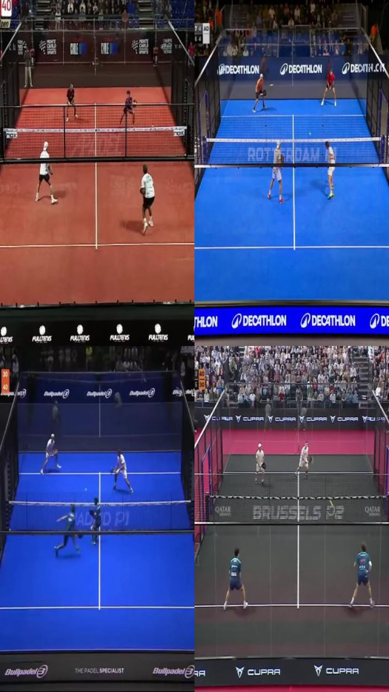
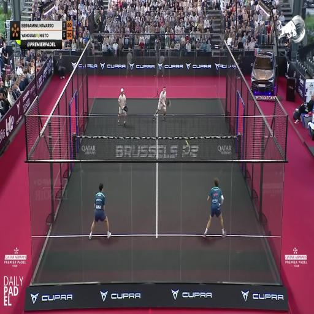
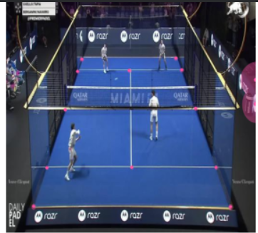
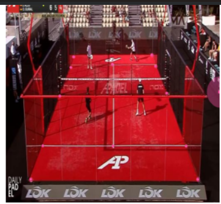
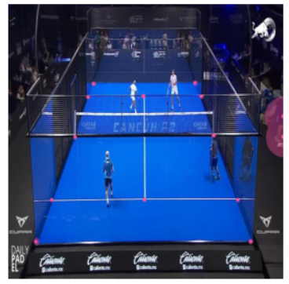

# 🎾 Padel Court Keypoint Detection using RF-DETR

<p align="center">
  
</p>

<p align="center">


</p>

---

## 📌 Overview

This repository presents an end-to-end implementation of **Padel Court Keypoint Detection** using **RF-DETR (Real-Time Detection Transformer)**. The model is trained on a custom **COCO Keypoint** dataset to accurately identify court landmarks under different viewing angles and lighting conditions.

The detected keypoints enable applications such as:

* 🎾 Court Calibration
* 📐 Homography Estimation
* 👤 Player Tracking
* 🎯 Ball Tracking
* 📊 Sports Analytics
* 📹 Broadcast Camera Calibration
* 🥽 Augmented Reality Overlays

---

# 🖼️ Sample Results

| Input Image                              | Predicted Keypoints                       |
| ---------------------------------------- | ----------------------------------------- |
|  |  |

---

# 📂 Repository Structure

```text
Padel-Court-Keypoint-Detection/
│
├── assets/
│   ├── 1.png
│   ├── input.jpg
│   ├── output.jpg
│
├── notebooks/
│   ├── KeyPoint_Detection.ipynb
│
├── outputs/
│
├── requirements.txt
│
├── LICENSE
│
└── README.md
```

---

# 🚀 Features

* ✅ RF-DETR Transformer Architecture
* ✅ Custom COCO Keypoint Dataset
* ✅ Google Colab Ready
* ✅ GPU Accelerated Training
* ✅ Automatic Checkpoint Saving
* ✅ Validation & Evaluation
* ✅ Prediction Visualization
* ✅ Easy Inference Pipeline
* ✅ Mixed Precision Training
* ✅ Customizable Hyperparameters

---

# 📊 Dataset

The dataset consists of manually annotated **Padel Court** images in **COCO Keypoint Format**.

Each image contains annotated court landmarks that allow precise estimation of court geometry.

Example annotation:

```json
{
  "category_id": 1,
  "keypoints": [
    x1, y1, v1,
    x2, y2, v2,
    ...
  ]
}
```

---

# ⚙️ Installation

Clone the repository

```bash
git clone https://github.com/<YOUR_USERNAME>/Padel-Court-Keypoint-Detection.git
```

```bash
cd Padel-Court-Keypoint-Detection
```

Create a virtual environment

```bash
python -m venv venv
```

Activate it

Windows

```bash
venv\Scripts\activate
```

Linux / macOS

```bash
source venv/bin/activate
```

Install dependencies

```bash
pip install -r requirements.txt
```

---

# 📦 Install RF-DETR

```bash
pip install -q "rfdetr[train,visual]"
pip install roboflow supervision
```

---

# 🏋️ Training

Download the dataset from Roboflow and configure your API key.

Run the notebook

```bash
KeyPoint_Detection.ipynb
```

or

```python
trainer.fit(model, datamodule)
```

Training automatically saves the best model checkpoint.

---

# 🧠 Model Checkpoints

After training you will obtain

```text
checkpoint_best_regular.pth
checkpoint_last.pth
```

Load the best checkpoint

```python
from rfdetr import RFDETRKeypointPreview

model = RFDETRKeypointPreview.from_checkpoint(
    "checkpoints/checkpoint_best_regular.pth",
    device="cuda"
)
```

---

# 🔍 Inference

Run prediction

```python
predictions = model.predict(
    image,
    threshold=0.5
)
```

Visualize results

```python
annotated = annotate_keypoints(image, predictions)
```

---

# 📈 Results

| Metric            |              Value |
| ----------------- | -----------------: |
| Model             |            RF-DETR |
| Task              | Keypoint Detection |
| Dataset           | Custom Padel Court |
| Framework         |            PyTorch |
| Annotation Format |     COCO Keypoints |

---

# 🛠 Tech Stack

* Python
* PyTorch
* RF-DETR
* Roboflow
* OpenCV
* Supervision
* NumPy
* Pillow
* Google Colab

---

# 🎯 Applications

* Court Line Detection
* Sports Analytics
* Automatic Court Calibration
* Homography Estimation
* Camera Pose Estimation
* Match Analysis
* Broadcast Enhancement
* AR Court Visualization

---

# 📸 More Predictions

<p align="center">




</p>

---

# 🔮 Future Work

* Video inference
* Real-time detection
* ONNX export
* TensorRT optimization
* Streamlit deployment
* Multi-camera calibration
* Court segmentation
* Ball trajectory estimation

---

# 🤝 Contributing

Contributions are welcome.

1. Fork the repository
2. Create a new branch
3. Commit your changes
4. Submit a Pull Request

---

# ⭐ Support

If you found this repository helpful, please consider giving it a ⭐ on GitHub.

---

# 📄 License

This project is released under the **MIT License**.

---

## 👨‍💻 Author

**Sumit Patil**

Master's in Data Science | Computer Vision & Deep Learning Enthusiast

GitHub: https://github.com/Sumit-Patil-1997

LinkedIn: https://www.linkedin.com/in/sumitkpatil1997/
